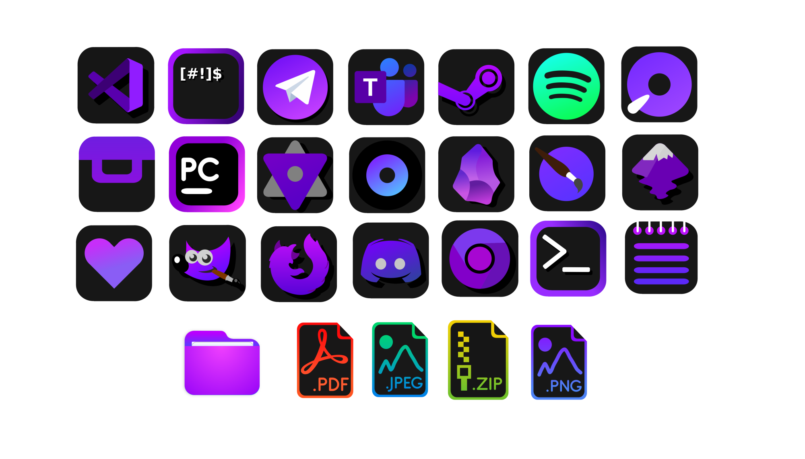

<b><h1>Purple-Accent-Icons</h1></b>
 still in devlopment
   

# how to download?

### Install script :
 comingsoon 
## Manual method
#### 
1. Click the green code button and download the zip  
2. Go to the zip directory and extract it  
3. Copy the folder directory path  
4. Open the terminal and type the following
\
\
`sudo cp -r "the copied file" /usr/share/icons`
  
  
  

on doing this the files is directed to /usr/share/icons and you will be able to change the icons from the settings
  
any ideas for the future of this icon pack? This icon pack lacks icons and is currently made on top of the base of deepin icon pack, over days more icons will be remade into Purple. we would love to hear your ideas and opinions on next icon to work on. Please email with your idea or wish on an icon to be remade. We will reachout as soon as possible
#### The icons are still under devlopment, for any inquires please contact; penwinthepirate@gmail.com \

##### please show love and support on: 
instagram : @im._najwan 
Discord : PENWINthePIRATE
